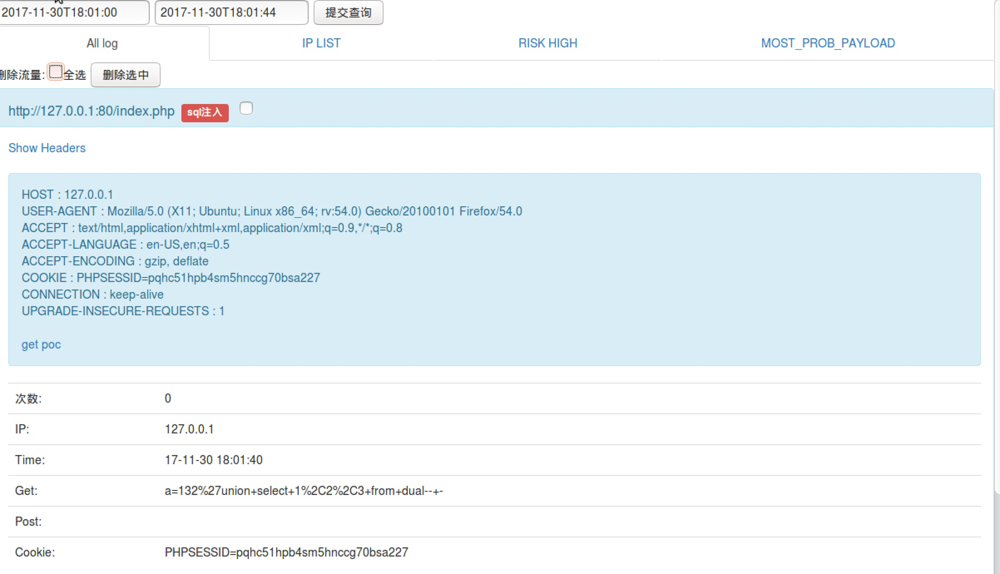

## 一个针对php的web流量抓取、分析的应用。

可供ctf线下赛使用，也可用于实际场景来抓web流量、分析攻击手段。




目前主要功能如下：

1. 完整http报文请求抓取，同时进行对可能存在的攻击进行分类，通过文件存储模拟出数据库，适应各种场合。

2. 根据hash判断流量是否重复，只记录次数和最新一次的请求包，减少存储空间的占用以及流量分析的成本。

3. 4个waf等级，推荐使用1等级，不会影响应用的正常运行，还可以抵御绝大多数的常见攻击。

4. 设置flag获取命令，通过分析页面返回判断是否被读取了flag，从而替换掉flag（有些场合可能无法使用），将此流量标记为危险流量，同时攻击者ip加入黑名单，永
久ban掉（可从黑名单去除）。

5. 黑白名单模式，可以手动添加，选择白名单模式，则服务正常通过给白名单机器，其他机器全部拦截。

6. 可根据ip、时间筛选出想要查看的对应日志。

7. 通过分析是否为危险流量，统计相同流量出现次数，显示出最可能是最终payload的流量排行。

8. 一键生成ctf线下赛exp（获取flag+自动提交flag），快人一步进行攻击（除了正常攻击流量外，exp中还包含大量垃圾混淆流量）

9. 删除并压缩备份选中的流量。

9. 因流量转发太过不公平，不考虑添加。


## 使用方法：

```
   web根目录创建一个777权限的目录，把所有文件拖入目录中
   访问install.php进行安装

```


## 待修复的bug:

### Exp：

* 增加一些固定和随机的混淆流量，现在的混淆流量很容易被区分

* 目标url和header中的host模板化

### php:

* 想办法处理cat flag > xxx 这种 ，同时不能只弄cat，还有其他输出方式，比如tac，这方面在flag过滤的地方也要处理

* 添加导入流量功能
